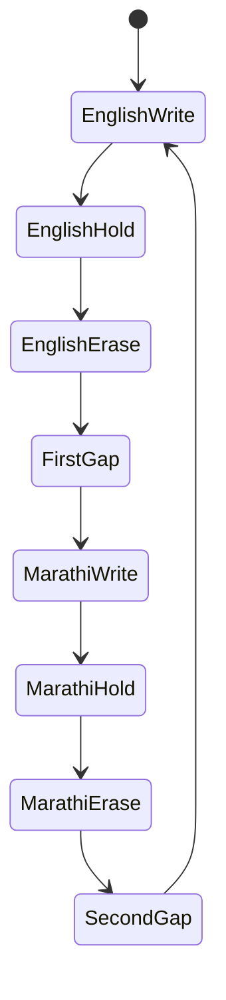
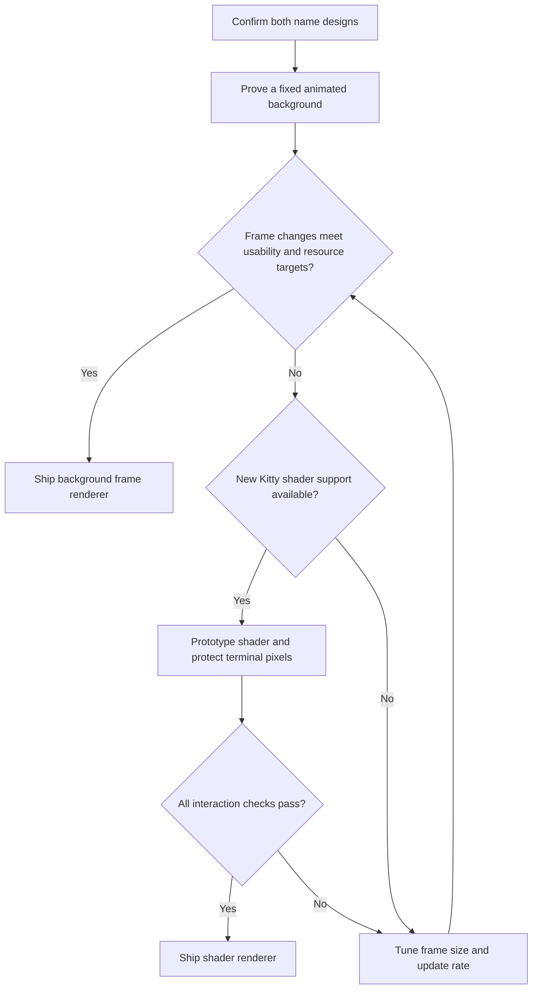

# Kedar Terminal — Complete Requirements and Solution Map

> **Implementation added:** The repository now includes a Kitty/Fish profile,
> bilingual background-frame builder, managed launcher, animation controls,
> backup/restore, and CPU/RSS plus shell-startup measurement tools. Start with
> [setup and usage](docs/SETUP.md) and [performance comparison](docs/PERFORMANCE.md).
> The version-controlled background is [assets/landscape.png](assets/landscape.png).
> The specification below is preserved; its proposed milestones and unchecked
> desktop acceptance items are not claims of completed hardware validation.

First setup: `make setup`, then `make launch`. After editing this checkout:
close managed terminal windows, run `make update`, then `make launch`.
Updates sync changed files, preserve local-only edits, stop on conflicting
edits, and reuse unchanged frame assets. `make static` opens the static theme.

```text
assets/              Tracked landscape and artwork provenance
config/              Kitty, Fish, Starship and animation defaults
src/kedar_terminal/  Asset preparation, runtime, controls and measurements
scripts/             Checkout-local CLI
tests/               Automated behavior and failure checks
docs/                Setup, restoration and performance methodology
reports/             Ignored local CSV/JSON measurement outputs
```

A personalized Ubuntu terminal with a dark teal aurora background, a startup greeting, command suggestions, a compact prompt, and a repeating English–Marathi name animation.

**Required loop:** KEDAR writes on → holds → writes off → केदार writes on → holds → writes off → repeat.

**Document status:** requirements and proposed implementation plan, dated 7 October 2026. The previously prepared Kedar_Terminal_Setup.zip provides the static theme. The bilingual animation described here still needs implementation and testing on the target computer. Proposed files and commands below are explicitly identified.

## 1. Intended result

Opening the terminal should immediately provide a usable shell. A welcome message appears once, and the decorative name animation runs behind the command area while the user works.

The background remains a quiet charcoal/navy aurora and mountain landscape. The animated name uses the stylish cyan block-character appearance approved in the terminal mockup. The two names occupy the same visual area.

The command line remains readable and responsive throughout the animation. Typing, selection, scrolling, completion menus, command execution, and tab switching must continue to work.

### Exact display names

| Language | Required display | Treatment |
| --- | --- | --- |
| English | KEDAR | Uppercase, matching the approved block-character design |
| Marathi, Devanagari script | केदार | Correctly shaped Marathi lettering with a compatible character-art appearance |

“ASCII art” describes the visual style here. Devanagari and the existing block/box-drawing characters use Unicode. The background artwork may be rendered as pixels; it does not have to consist of live terminal cells.

## 2. Complete requirement register

MUST means required for completion. SHOULD means a recommended default. MAY means optional.

| ID | Requirement | Priority | Completion evidence |
| --- | --- | --- | --- |
| R01 | Launch a usable terminal on Ubuntu | MUST | Shell accepts commands immediately |
| R02 | Use the approved charcoal/navy and teal palette | MUST | Visual review against the approved mockup |
| R03 | Show an aurora/mountain background instead of flat violet | MUST | Background appears in the actual terminal |
| R04 | Display KEDAR in the approved stylish character-art treatment | MUST | English artwork approved |
| R05 | Display केदार with correct Devanagari shaping | MUST | Marathi artwork visually checked |
| R06 | Reveal English, erase English, reveal Marathi, erase Marathi, and repeat | MUST | Several complete cycles observed |
| R07 | Keep the decorative name anchored while terminal output scrolls | MUST | Long-output and scrollback checks |
| R08 | Keep the landscape visible during the blank-name phases | MUST | No whole-background flash or removal |
| R09 | Keep typing, selection, copy/paste and suggestions functional | MUST | Interaction checks during playback |
| R10 | Show a greeting once per new interactive shell | MUST | New tabs greet; noninteractive scripts do not |
| R11 | Provide muted inline command suggestions | MUST | Suggestions appear and can be accepted |
| R12 | Provide Tab completion for commands, paths and supported tools | MUST | Git/path/npm completion checks |
| R13 | Show username, directory and Git branch in a compact prompt | MUST | Prompt checked inside/outside a repository |
| R14 | Support terminal tabs and panes | MUST | New tabs/panes do not create competing loops |
| R15 | Expose timing, colors, position, scale and renderer settings | MUST | Configuration changes take effect |
| R16 | Provide animation start, stop, restart, status and static mode | MUST | Each control works independently of the shell |
| R17 | Stop animation resources when the owning terminal closes | MUST | No orphan controller remains |
| R18 | Preserve existing configuration with backup and restore | MUST | Restore recovers replaced files |
| R19 | Continue providing a usable shell if animation fails | MUST | Failure returns to a static background |
| R20 | Respect the user's XDG directories | SHOULD | Custom config/runtime directories work |
| R21 | Keep working without network access after installation | MUST | Offline startup and playback |
| R22 | Use a restrained frame rate and bounded resource use | SHOULD | Target-machine measurements recorded |
| R23 | Support responsive positioning and multiple display scales | SHOULD | Resize and HiDPI checks |
| R24 | Offer battery-saving and focus-pause settings | MAY | Optional policies work when enabled |
| R25 | Offer zoxide for faster project navigation | MAY | Directory-jump integration works |
| R26 | Offer an extra real terminal-text startup banner | MAY | Banner prints once and is understood to scroll |

## 3. Animation contract

“Write on” means progressive construction of the name. “Write off” means progressive erasure. A whole-word crossfade alone does not satisfy this requirement.

### Recommended first implementation

- Reveal the fully designed name progressively from left to right, using character-sized blocks or narrow groups of columns.
- Erase it in the reverse direction, from right to left.
- Keep a short readable hold after each complete name.
- Insert a brief blank-name gap between languages.
- Keep both names at a common baseline with similar visual height and weight.
- Keep the landscape stationary throughout.
- Begin with English when a new managed terminal instance starts.
- Repeat continuously until stopped or the terminal closes.

A hand-drawn pen-stroke effect is an optional future style. It requires authored stroke paths; revealing a filled font outline is not automatically a handwriting animation.

### Suggested initial timing

These are proposed defaults, not fixed user requirements.

| Phase | Visible state | Duration |
| --- | --- | ---: |
| English write on | Blank → complete KEDAR | 1.8 s |
| English hold | Complete KEDAR | 2.0 s |
| English write off | Complete KEDAR → blank | 1.2 s |
| First gap | Landscape only | 0.4 s |
| Marathi write on | Blank → complete केदार | 1.8 s |
| Marathi hold | Complete केदार | 2.0 s |
| Marathi write off | Complete केदार → blank | 1.2 s |
| Second gap | Landscape only | 0.4 s |
| **Complete loop** | English + Marathi | **10.8 s** |

Start at 12 frames per second for a block-style animation. Higher rates are an optimization choice after measuring the selected renderer.



Use a monotonic clock to determine the current phase and progress. If a frame arrives late, skip to the correct progress rather than letting every cycle grow longer.

When a configured focus or battery policy pauses playback, the controller must define whether it freezes the current phase or restarts the cycle. Recommended pause behavior: freeze and resume.

Continuous playback remains the default. Focus pause and battery policies are optional.

## 4. Selected tools and responsibilities

| Requirement area | Selection | Responsibility |
| --- | --- | --- |
| Terminal | Kitty | Actual terminal window, colors, font, tabs, panes and background |
| Shell | Fish | Suggestions, completions, syntax colors and interactive greeting |
| Prompt | Starship | Username, path, Git branch and slow-command duration |
| Command font | Fira Code | Readable monospace command text |
| Marathi artwork font | Noto Sans Devanagari, or an approved equivalent | Source glyph shapes for the Marathi artwork |
| Asset preparation | Python + Pillow with RAQM available | Shape and rasterize names, create masks and frames |
| Background controller | Small Python process, where needed | Timing, ownership, renderer calls and lifecycle |
| Optional navigation | zoxide | Remember frequently visited directories |

This separates shell behavior from decorative rendering. A greeting function should not own an endless animation loop.

Fish provides suggestions and completion; Starship formats the prompt. See the official [Fish interaction documentation](https://fishshell.com/docs/current/interactive.html) and [Starship guide](https://starship.rs/guide/).

## 5. Important change from the static theme

The earlier wallpaper has KEDAR permanently painted into it. Animating another name over that image would leave the original English name visible during erasure and Marathi phases.

The animation therefore needs separate source assets:

| Asset | Purpose |
| --- | --- |
| Landscape without lettering | Permanent aurora/mountain base |
| English mask/artwork | Approved KEDAR design |
| Marathi mask/artwork | Approved केदार design |
| Static fallback | Complete landscape with one approved name |
| Animation settings | Timing, position, colors and backend |
| Generated frames or shader data | Backend-specific playback material |

The existing wallpaper remains useful as a design reference and a static fallback. Creating the landscape without lettering is an implementation task; this README does not claim that asset already exists.

## 6. Potential solution map

| Option | How it works | Advantages | Main limitation | Decision |
| --- | --- | --- | --- | --- |
| Static wallpaper | One PNG with the name | Simple and dependable | Cannot provide the requested loop | Keep as fallback |
| Shell text animation | Print and erase terminal characters | Easy startup demo | Competes with normal output and scrolls | Suitable only for a separate demo or reserved pane |
| **A: Kitty background frame changes** | Compose complete background PNGs and change the real background over time | Anchored background; terminal text remains separately rendered | Repeated image transfer/decoding can be costly | **Recommended first working version** |
| **B: Kitty custom shader** | Render timed name masks in Kitty's GPU post-processing pipeline | Potentially smooth playback without sending full PNGs per frame | Requires newer Kitty and careful protection of terminal pixels | **Preferred optimization candidate after proof** |
| C: Kitty graphics-protocol animation | Display a looping image with graphics placements | Native animation and layering facilities | Content placements normally interact with scrolling and screen clearing | Experimental until fixed placement is proven |
| Desktop animated wallpaper | Put animation behind a transparent terminal | Can be attractive | Desktop coordinates and window movement affect placement | Poor fit for a terminal-specific name |

**Recommendation:** build Option A first to prove the exact bilingual behavior and terminal usability. Evaluate Option B once the visual assets and timings are approved. Adopt B only if it preserves terminal content and behaves correctly on the user's hardware.

The recommendation is an engineering judgment, not a measured performance result.

### Decision path



## 7. Option A — recommended first working version

### Asset pipeline

1. Prepare a landscape without lettering.
2. Produce the English artwork and correctly shaped Marathi artwork.
3. Build reveal masks for each phase.
4. Composite each changing name frame onto the same landscape.
5. Save frames and a manifest containing phase, duration, dimensions and asset hashes.
6. Include one landscape-only frame and one static fallback frame.

Pre-render assets outside shell startup. Do not render fonts, regenerate artwork or run image generation for every terminal opening.

### Playback

A managed Kitty instance exposes a local control socket. One controller advances the state machine and updates that instance's background.

Kitty documents background changes through set-background-image. These changes operate at the OS-window background level; selecting a pane identifies its containing OS window. The command also supports choosing an index from configured images. See [Kitty remote control](https://sw.kovidgoyal.net/kitty/remote-control/).

A diagnostic command inside a managed Kitty session can resemble:

```bash
kitten @ --to "$KITTY_LISTEN_ON" set-background-image --match "id:$KITTY_WINDOW_ID" --layout cscaled /absolute/path/to/frame.png
```

This is a single-frame diagnostic example. It is not the complete animation implementation. Older Kitty distributions may use kitty @ rather than the separate kitten command; check the installed tools before selecting a backend.

Use a unique local socket created by the launcher and socket-only control. Resolve the actual listener address instead of assuming a fixed filename. Kitty can append a process identifier to configured socket paths. See [Kitty control configuration](https://sw.kovidgoyal.net/kitty/conf/).

### Instance and tab ownership

- Use one controller per managed Kitty process, not one per Fish shell.
- Synchronize owned OS windows to the same phase by default.
- New tabs and panes join the existing animation.
- Discover representative pane IDs for each owned OS window when needed.
- Handle pane closure and new OS windows without retaining invalid IDs.
- Scope updates to the owned Kitty instance.
- Avoid concurrent controllers overwriting the same background.

### Performance choices

Do not resend an identical image during holds. Send the completed name once, then wait until the erase phase. Do the same for blank phases.

Profile both documented approaches: sending a PNG path and selecting previously configured image indices. An index can avoid retransmitting a full image, but caching many full-size frames may use substantial GPU memory. Measure both.

Illustrative sizing, not a benchmark:

- A decoded 1920 × 1200 RGBA image is about 8.8 MiB.
- 100 decoded frames at that size represent about 879 MiB before other overhead.
- Transmitting a 1 MiB encoded frame 12 times per second is 12 MiB/s before protocol encoding; base64 would increase that payload to approximately 16 MiB/s.

Therefore, do not assume that loading an entire frame set into memory is cheap. Use bounded caching, appropriate resolution, and fewer updates during holds.

## 8. Option B — custom shader optimization

Kitty added official custom shaders in version 0.49.0. Its shader system uses Slang files and pipeline files, exposes time and geometry, and supports timed redraws. See [custom shaders](https://sw.kovidgoyal.net/kitty/custom-shaders/) and the [Kitty changelog](https://sw.kovidgoyal.net/kitty/changelog/).

Proposed approach: generate the name masks offline, encode compact mask data in shader source, and use time to reveal or erase them in a bounded region. Keep the landscape in the normal background.

A proposed configuration entry would be:

```conf
custom_shaders kedar-name-loop
```

The named shader and pipeline must be implemented first; they are not built-in Kitty effects.

**Critical gate:** shaders run after terminal rendering. They are not automatically a background-only layer. The implementation must preserve command glyphs, their antialiased edges, selections, cursor and completion colors. Comparing pixels with a single background color is insufficient over a photographic wallpaper.

Do not assume arbitrary external PNG textures can be declared in the pipeline: documented named textures are rendering buffers. Embedded mask data is one proposed solution.

Only ship this renderer after output-preservation checks pass. Otherwise retain Option A.

## 9. Option C — native graphics animation

Kitty's graphics protocol includes animation and z-ordering. The icat tool offers animation-loop controls and negative z-index placement. These facilities make it a useful experiment.

However, graphics placements participate in terminal content behavior. A looping GIF displayed with icat is not proof of a permanent, viewport-anchored background.

Before selecting this option, prove scrolling, clear, resize, alternate-screen applications and placement restoration. Avoid repeated graphics writes through the user's interactive command stream.

Sources: [graphics protocol](https://sw.kovidgoyal.net/kitty/graphics-protocol/) and [icat](https://sw.kovidgoyal.net/kitty/kittens/icat/).

Do not treat GIF support in an image-format list as a guarantee of looping background_image playback.

## 10. Marathi rendering requirements

Use the exact string केदार. Normalize source text to Unicode NFC.

The vowel mark attached to क must remain visually correct. Shape the full word before stylizing it. Use Pillow with RAQM support or another established shaping stack; RAQM uses HarfBuzz for shaping. Check support rather than silently accepting an unshaped rendering.

A diagnostic check:

```bash
python3 -c "from PIL import features; print(features.check_feature('raqm'))"
```

For a shaped raster, use the approved Devanagari font, then convert the result into the desired block/grid treatment without losing the headline, vowel marks or letter identity.

Animate the finished artwork through masks. Do not erase arbitrary UTF-8 bytes or individual combining code points. If an optional text-typing mode is built, operate on grapheme clusters and review every intermediate state.

Primary references: [Pillow complex-layout dependencies](https://pillow.readthedocs.io/en/stable/installation/building-from-source.html) and [Noto Sans Devanagari](https://fonts.google.com/noto/specimen/Noto+Sans+Devanagari).

## 11. Appearance and positioning

| Property | Recommended initial value |
| --- | --- |
| Landscape | Dark charcoal/navy aurora and mountain scene |
| Name style | Approved sculpted block-character appearance |
| Name color | Restrained pale cyan to teal shading |
| Command foreground | #dce7ee |
| Accent | #45d5dc |
| Command-path color | #70aee5 |
| Muted suggestion | #748a9f |
| Background color | #09131d |
| Background tint | Approximately 0.25–0.40 |
| Name position | Middle-right, within terminal content bounds |
| Name scale | Similar visual size in both scripts |
| Command font size | 12.5–14 pt |
| Padding | 16–24 pt |

Use normalized coordinates for the name region. Preserve both names' aspect ratios and scale them to a common bounding box. A narrow window may shrink or hide the decoration; the shell must remain usable.

For the new animation, prefer aspect-preserving asset placement with a safe margin. The previous static theme used scaled layout; the animation may choose cscaled after checking crop behavior.

Name styling must not obscure command output, particularly when output reaches the right side. Full-screen applications need a reliable manual animation-disable control. Automatic application detection is optional and must be implemented before being advertised.

## 12. Greeting, shell and prompt

Keep the greeting independent of animation. Recommended text: Welcome back, Kedar. Follow it with the computer's local date and time.

A minimal Fish greeting:

```fish
function fish_greeting
    set_color --bold 45d5dc
    printf 'Welcome back, Kedar.\n'
    set_color 748a9f
    date '+%A, %d %B · %H:%M'
    set_color normal
    printf '\n'
end
```

Fish calls this function for interactive shells. It must not start a fresh animation controller on every invocation. Source: [fish_greeting](https://fishshell.com/docs/current/cmds/fish_greeting.html).

Keep Starship initialization in one location:

```fish
if status is-interactive
    starship init fish | source
end
```

Use the earlier compact prompt: username, path, Git branch, slow-command duration and a second-line command marker. The included static theme already contains its Starship configuration.

Fish's default suggestions and completion behavior should remain intact. Validate npm script completion inside the actual project, where available choices come from its package.json and installed completion definitions.

## 13. Proposed configuration interface

The following file is a proposed schema, not a configuration already understood by a shipped animation program.

```toml
[animation]
enabled = true
backend = "kitty-background-frames"
languages = ["en", "mr"]
english_text = "KEDAR"
marathi_text = "केदार"
style = "block-reveal"
fps = 12
write_on_seconds = 1.8
hold_seconds = 2.0
write_off_seconds = 1.2
gap_seconds = 0.4
repeat = true
pause_when_unfocused = false
battery_saver = false

[appearance]
anchor = "middle-right"
name_opacity = 0.35
preserve_aspect_ratio = true
foreground = "#45d5dc"

[runtime]
scope = "managed-kitty-instance"
synchronize_os_windows = true
fallback = "static-english"
log_level = "warning"
```

Validate ranges, asset existence and supported backend names. Configuration errors should fall back to the static theme with a clear diagnostic.

Proposed command interface, to implement:

| Command | Intended effect |
| --- | --- |
| kedar-animation start | Start playback for the owned instance |
| kedar-animation stop | Stop playback and restore the configured static background |
| kedar-animation restart | Reload settings and begin from English |
| kedar-animation status | Show backend, ownership, phase and health |
| kedar-animation static | Select static mode |
| kedar-animation doctor | Check versions, assets, fonts, shaping and control access |

These commands do not exist in the earlier static package.

## 14. Proposed project structure

| Path | Role | Present in earlier package? |
| --- | --- | --- |
| README.md | This specification and solution map | New document |
| config/animation.toml | User-facing animation settings | To build |
| assets/landscape.png | Background without lettering | To create |
| assets/english-mask.png | Approved English artwork mask | To create |
| assets/marathi-mask.png | Shaped Marathi artwork mask | To create |
| assets/static-fallback.png | Safe still image | Existing wallpaper can supply this |
| assets/fonts/ | Approved font references or licensed font assets | To prepare |
| generated/frames/ | Composited frame sequence | To generate |
| generated/manifest.json | Frame timings, hashes and dimensions | To generate |
| shaders/kedar-name-loop.slang | Optional shader renderer | To build |
| shaders/kedar-name-loop.pipeline | Optional shader scheduling | To build |
| src/controller.py | Runtime state machine and supervision | To build |
| src/renderers/background_frames.py | Background-control adapter | To build |
| src/renderers/shader.py | Optional shader configuration adapter | To build |
| scripts/build_assets.py | Offline name shaping and frame preparation | To build |
| scripts/launch_terminal.py | Managed terminal startup and socket lifecycle | To build |
| scripts/install.py | Backup, install and restore extension | Earlier apply_theme.py is a starting point |
| kitty.conf.in | Kitty profile template | Available |
| kedar.fish.in | Fish theme template | Available |
| fish_greeting.fish | Greeting function | Available |
| starship.toml | Prompt configuration | Available |

Use XDG_CONFIG_HOME for configuration, XDG_CACHE_HOME for regenerable assets, and XDG_RUNTIME_DIR for live sockets/locks where available. Do not write derived frames into a shared global temporary path.

Do not bundle copyrighted fonts without checking their distribution license. Referencing an installed font is an acceptable build strategy.

## 15. Installation and compatibility plan

### Working static baseline

Run setup commands in Bash:

```bash
bash
sudo apt update
sudo apt install kitty fish fonts-firacode git curl unzip python3
curl -fsSL https://starship.rs/install.sh -o /tmp/kedar-starship-install.sh
sh /tmp/kedar-starship-install.sh
```

Then apply the previously provided package:

```bash
cd ~/Downloads
unzip Kedar_Terminal_Setup.zip
cd kedar-terminal
python3 apply_theme.py
kitty
```

The static installer backs up the six replaced files and checks Fish syntax before applying them. It does not implement bilingual playback.

### Animation dependencies to evaluate

| Dependency | Need |
| --- | --- |
| Python virtual environment | Isolate asset-building dependencies |
| Pillow with verified RAQM support | Correct Marathi artwork generation |
| Approved Devanagari font | Source glyph design |
| Kitty background control | Required for Option A |
| Kitty 0.49.0+ with working shader support | Required only for Option B |
| Slang shader tooling supplied by or compatible with the selected Kitty build | Required only when building/running custom shaders |
| Optional zoxide | Navigation enhancement |

The Ubuntu package version may be older than the shader-capable release. Check kitty --version and the actual shader capability; do not assume apt installs a particular version.

Keep ordinary Bash scripts executable through their shebang or bash script.sh. Fish does not automatically inherit Bash-only functions such as nvm. Configure development-tool PATH or a Fish-compatible version-manager integration separately.

The default shell can remain Bash while Kitty launches Fish.

## 16. Runtime and failure behavior

- Show the prompt before any slow optional asset preparation.
- Use cached, validated assets; build missing assets through an explicit setup step.
- Use one ownership lock per managed Kitty instance.
- Redirect controller logs away from the interactive terminal.
- Never call clear or repaint the command area as an animation technique.
- Do not read keystrokes or change terminal input modes for decorative playback.
- On terminal closure, stop the controller and remove only its own runtime files.
- On control failure, retry a bounded number of times, then enter static mode.
- Keep the prior theme recoverable.
- On unsupported terminals, show the greeting and normal prompt with static or plain styling.
- Do not start local animation management inside an SSH remote shell.
- tmux and alternate-screen behavior require explicit checks; they are not automatically supported by every image renderer.

Background controls and animation must remain separate from shell stdout/stderr so command output is not polluted.

## 17. Performance targets

These are proposed acceptance targets to measure on Kedar's computer, not published claims about Kitty or the prototype.

| Metric | Proposed target |
| --- | --- |
| Baseline playback | 12 fps during changing phases |
| Hold/gap updates | No identical-frame retransmission |
| Shell startup | Animation adds no more than 200 ms to time-to-ready |
| Controller memory | Aim below 128 MiB, excluding Kitty's own GPU allocations |
| CPU | Aim for under 10% of one logical core averaged over a complete loop |
| Interaction | No noticeable added typing or completion lag |
| Long-running operation | No increasing memory use or duplicate controllers |
| Failure recovery | Usable static theme without a shell restart |

Measure shell-only, static-theme and animated-theme baselines. Record hardware, resolution, Kitty version, backend and frame rate with results.

For a shader renderer, measure GPU activity and power use as well as CPU. A low CPU percentage alone does not show that animation is cheap.

If targets fail, profile first, then adjust resolution, frame caching or renderer choice. A static fallback keeps the terminal usable but does not count as completion of the required animated loop.

## 18. Implementation milestones

| Milestone | Deliverable | Gate |
| --- | --- | --- |
| M0: Baseline | Kitty, Fish, Starship, greeting and static theme | Suggestions/prompt work on the actual computer |
| M1: Visual assets | Background without lettering and both approved names | Marathi shaping and equal visual weight approved |
| M2: Background proof | Two real background states switch without moving the cursor | Scrolling, selection and command text remain intact |
| M3: Bilingual loop | Eight phases, timing settings and continuous playback | English → Marathi → English observed repeatedly |
| M4: Lifecycle and controls | Instance ownership, controls, fallback and cleanup | No duplicate/orphan controllers |
| M5: Performance | Measurements and any backend optimization | Resource and interaction targets accepted |
| M6: Packaging | Installation, backup/restore, troubleshooting and final demo | New installation and restore verified |

Do not implement multiple production renderers before M2 proves the primary one. Share the same timing state machine and visual assets if a second renderer is introduced.

## 19. Acceptance checklist

### Names and sequence

- [ ] English reads exactly KEDAR.
- [ ] Marathi reads exactly केदार.
- [ ] Marathi vowel marks and headline are correct.
- [ ] Each name progressively writes on and writes off.
- [ ] The landscape remains during gaps.
- [ ] Only the intended language is visible in each name phase.
- [ ] At least ten cycles repeat in the correct order.
- [ ] Timing does not visibly drift.

### Terminal use

- [ ] Typing remains responsive throughout the loop.
- [ ] Inline suggestions can be accepted normally.
- [ ] Completion choices remain readable and selectable.
- [ ] Long output and scrollback do not move the decoration.
- [ ] Copy/paste and selection preserve their usual behavior.
- [ ] clear, resize and tab switching are handled.
- [ ] Git/npm/project commands remain usable.
- [ ] Vim, less and other alternate-screen programs are checked.
- [ ] A narrow window remains usable.
- [ ] HiDPI rendering remains sharp enough.

### Ownership, failure and restoration

- [ ] New tabs/panes do not create competing loops.
- [ ] Separate managed instances do not control one another.
- [ ] Closing a pane does not incorrectly stop the instance's animation.
- [ ] Closing the terminal stops its controller.
- [ ] Missing assets or unavailable control access produce static fallback.
- [ ] Animation stop/restart/static commands work.
- [ ] Offline playback works.
- [ ] Backups and restore are verified.
- [ ] Extended playback shows bounded memory/resource use.

## 20. Troubleshooting map

| Symptom | Likely cause | Investigation |
| --- | --- | --- |
| English remains behind Marathi | Old wallpaper contains permanent lettering | Replace the base with a landscape without lettering |
| Marathi letters look detached | Font or shaping backend is unsuitable | Check the font, RAQM availability and the full-word render |
| Animation scrolls away | Renderer uses content placements or terminal text | Prove a true background backend |
| Prompt/output flickers | Animation writes to the interactive terminal | Move playback to the background-control channel |
| Loop accelerates or phases fight | More than one controller owns the same instance | Check ownership locks and startup hooks |
| High memory use | Too many decoded full-size frames are cached | Measure frame residency and bound caches |
| High CPU/control traffic | Full image resent during every hold | Send only changing frames and profile index selection |
| Shader changes command colors | Post-processing modifies rendered foreground pixels | Fail the shader gate and use background frames |
| Only the first image frame appears | Image display and background playback were conflated | Verify the actual chosen playback mechanism |
| Missing npm/node in Fish | Tool is initialized only through Bash configuration | Configure Fish PATH or version-manager integration |
| Duplicate greeting or prompt | Existing Fish configuration overrides supplied functions | Keep one greeting and one prompt initialization |
| Decoration is cropped | Layout and name safe margins disagree | Recompute bounds or use a different asset crop |

## 21. Decisions already made and defaults still adjustable

| Item | Decision |
| --- | --- |
| Name | Kedar |
| English display | KEDAR |
| Marathi display | केदार |
| Background | Approved dark teal aurora/mountain concept |
| English visual style | Approved stylish block-character design |
| Language order | English first, then Marathi, repeat |
| Effect | Progressive write on and progressive write off |
| Terminal stack | Kitty + Fish + Starship |
| First implementation | True background frame changes |
| Optimization candidate | Kitty custom shader, subject to output-preservation proof |
| Extra terminal-text banner | Optional; disabled initially |
| Timing, position and opacity | Proposed defaults; configurable |
| Marathi's final block-art design | Still needs visual approval |
| Target Ubuntu/Kitty versions | Still need checking on the computer |

## 22. Scope of this deliverable

This README consolidates the full terminal requirements and maps feasible implementation routes. It extends the earlier static theme specification with bilingual animated lettering.

It does not supply an implemented animation controller, finished Marathi artwork, background without lettering, frame sequence or custom shader. Those deliverables are listed explicitly in the roadmap.

The previous static theme's configuration checks do not validate the new animation. Completion requires the actual Ubuntu interaction and lifecycle checks above.

## 23. Primary technical references

Documentation checked on 7 October 2026:

1. [Kitty configuration](https://sw.kovidgoyal.net/kitty/conf/)
2. [Kitty background remote control](https://sw.kovidgoyal.net/kitty/remote-control/)
3. [Kitty custom shaders](https://sw.kovidgoyal.net/kitty/custom-shaders/)
4. [Kitty release history](https://sw.kovidgoyal.net/kitty/changelog/)
5. [Kitty graphics protocol](https://sw.kovidgoyal.net/kitty/graphics-protocol/)
6. [Kitty icat](https://sw.kovidgoyal.net/kitty/kittens/icat/)
7. [Fish interactive behavior](https://fishshell.com/docs/current/interactive.html)
8. [Fish greeting](https://fishshell.com/docs/current/cmds/fish_greeting.html)
9. [Fish for Bash users](https://fishshell.com/docs/current/fish_for_bash_users.html)
10. [Starship guide](https://starship.rs/guide/)
11. [Pillow text-layout dependencies](https://pillow.readthedocs.io/en/stable/installation/building-from-source.html)
12. [Noto Sans Devanagari](https://fonts.google.com/noto/specimen/Noto+Sans+Devanagari)
